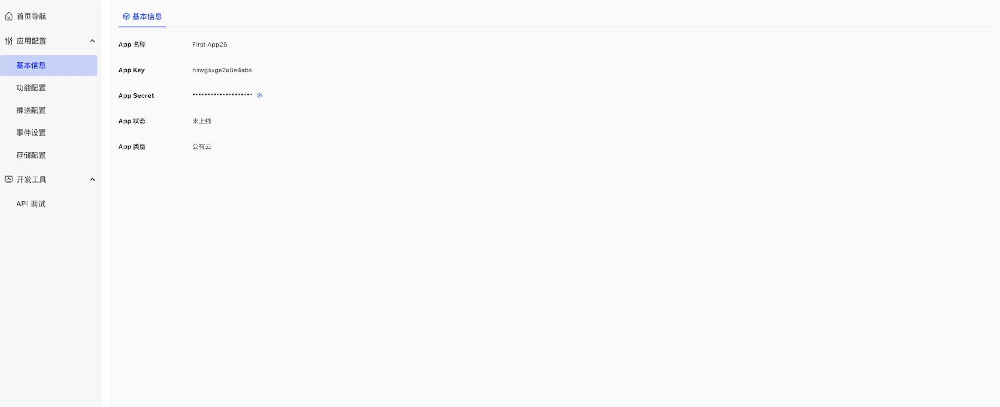
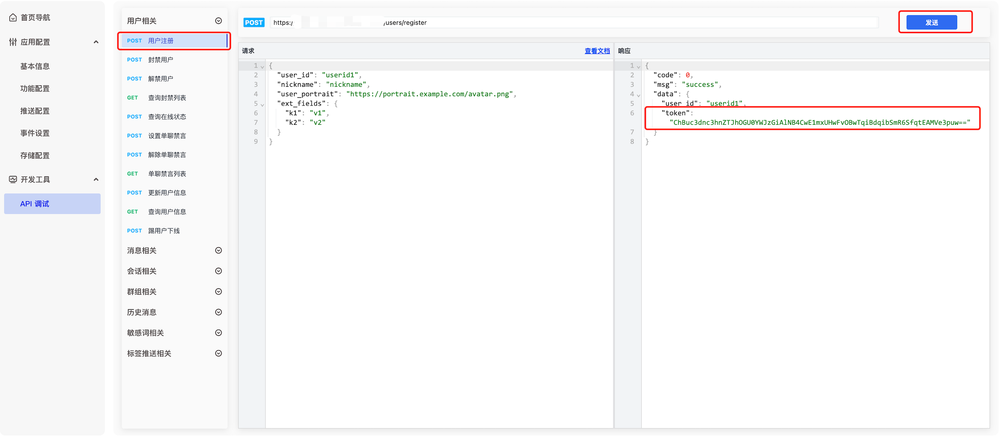
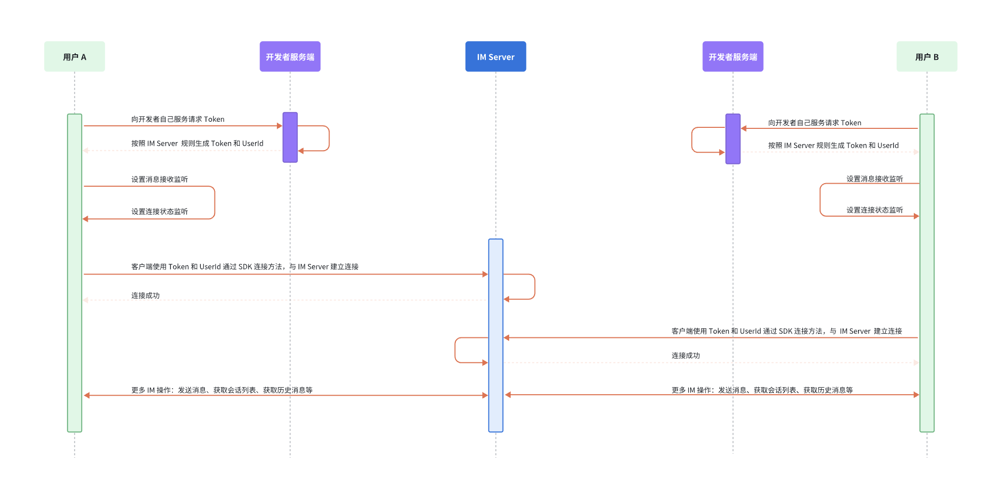

### Preparation{#pre}

1. Create an application in the `Developer server` to obtain your `AppKey` and `Secret`.



2. Call the server API to obtain the token yourself, or in the Developer server, navigate to Select Application -> Development Tools -> API -> User Related, and call the user registration interface to obtain two test tokens.



3. Follow the integration steps as outlined in the integration document.

### Workflow{#flow}



### Add Dependencies {#install}

In addition to importing the SDK, you need to add the following dependency:

```sh
# pubspec.yaml
dependencies:
  juggle_im: 0.0.63
```

### Sample Code{#code}

```dart
await JuggleIm.instance.setServers(["wss://ws.im.com"]); // Replace "wss://ws.im.com" with your deployed server URL
await JuggleIm.instance.init("appkey");
JuggleIm.instance.onConnectionStatusChange = (int connectionStatus, int code, String extra) {
  if (connectionStatus == SDKConnectionStatus.CONNECTED) {
    // Connection successful
  }
  if (connectionStatus == SDKConnectionStatus.CONNECTING) {
    // Connecting
  }
  if (connectionStatus == SDKConnectionStatus.DISCONNECTED) {
    // Connection lost
  }
  if (connectionStatus == SDKConnectionStatus.FAILURE) {
    // Connection failed; 'code' is the error code, 'extra' is the error message
  }
};
await JuggleIm.instance.connect("token");
```

If the connection fails, please refer to [Connection Error Code](../sdkintro/status_code/ios.mdx) for a detailed description of the `code`.
