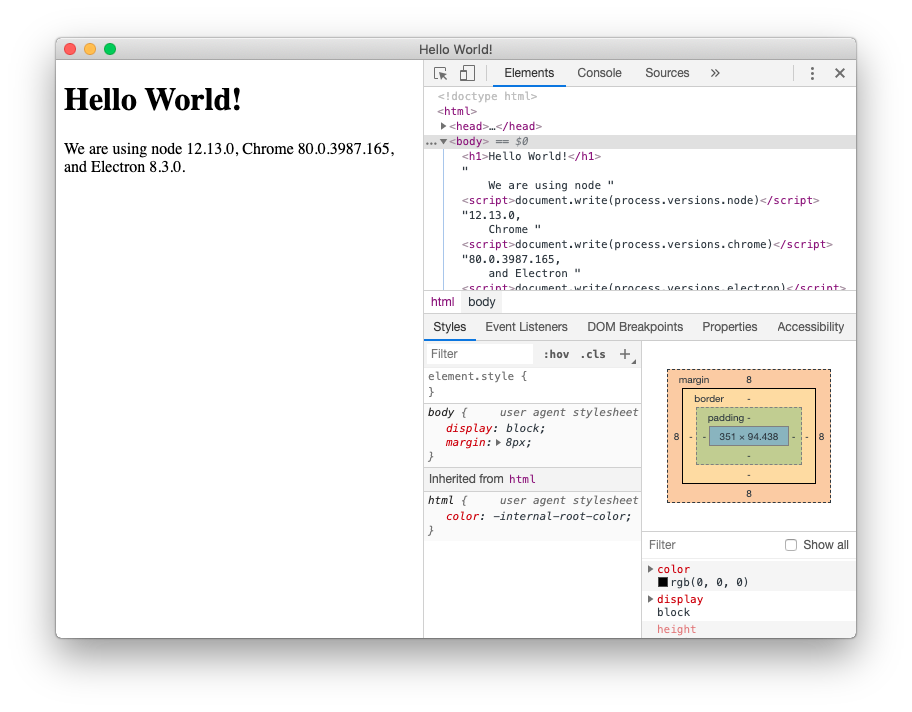

<div style="margin: 1rem 0 1.5rem; padding: 1.25rem 1.5rem; border-left: 5px solid #24b36b; border-radius: 0 14px 14px 0; background: linear-gradient(180deg, #eef8f2 0%, #f7fbf8 100%);">
  <div style="margin-bottom: 0.9rem; color: #169c59; font-size: 1.15rem; font-weight: 700;">Tips</div>
  <p style="margin: 0 0 1rem;">Electron provides a message storage module to support offline usage and improve user experience. You can integrate HTML that already includes the JavaScript SDK into Electron to build a PC application.</p>
  <p style="margin: 0;">This tutorial demonstrates how to build a minimalist PC IM application by combining the Electron framework with the IM SDK. Let's get started.</p>
</div>

### Preparation{#pre}

1. Create an application in the `Developer server` to obtain your `AppKey` and `Secret`.


2. Call the server API to obtain tokens yourself, or use the Developer server -> Select Application -> Development Tools -> API -> User Related, and call the user registration interface to get two test tokens.


3. Download [juggleim-dev-1.9.0.zip](./juggleim-dev-1.9.0.zip) and place `juggleim-dev-1.9.0.js` in the same directory as `index.html`.

4. Follow the integration steps as outlined in the integration documentation.

### Integrate Electron{#electron}

Please refer to the official Electron [Quick Start](https://www.electronjs.org/docs/latest/tutorial/tutorial-prerequisites) guide to create a minimal HelloWorld application, as shown below:



After successfully running the HelloWorld application, you will have the following files:

> **main.js** - Main process entry point

> **preload.js** - Exposes API methods to the renderer process and handles communication with the main process

> **index.html** - Demo page

> **package.json** - Project dependencies and scripts

### Import IM SDK{#import}

In Electron, the SDK automatically detects and switches to local storage mode. There are two steps to integrate the IM SDK:

**Step 1:** Include the integrated JavaScript SDK in the web page. Refer to the [Web Integration](./quickstart.md) guide, and replace the demo page content in your HelloWorld application's `index.html`.

**Step 2:**

```js
// (1) Install dependencies
npm install jim-electron --save

// (2) Import in main.js
const JMain = require('jim-electron/main');

app.whenReady().then(() => {
  const win = new BrowserWindow({
    width: 800,
    height: 600,
    webPreferences: {
      // [Important] Must be set to true
      nodeIntegration: true,
      preload: path.join(__dirname, 'preload.js')
    }
  });
  win.loadFile('index.html');

  // Open developer tools
  win.webContents.openDevTools();
  JMain.init();
});

// (3) Import in preload.js, no additional operations required
require('jim-electron/render');
```

### Complete code{#code}

After installing the dependency package, copy the following code into the `index.html`, `preload.js`, and `main.js` files respectively. Then run `npm run start` from the project root directory to preview.

<Tabs
groupId="sdks-language"
values={[
  { label: 'index.html', value: 'index.html' },
  { label: 'preload.js', value: 'preload.js' },
  { label: 'main.js', value: 'main.js' },
]}
>
<TabItem value="index.html">

```html
<!DOCTYPE html>
<html lang="en">
<head>
  <meta charset="UTF-8" />
  <title>IM</title>
  <script src="./juggleim-dev-1.9.0.js"></script>
  <style>
    .container {
      height: 200px;
      width: 600px;
      background-color: rgb(119, 128, 226);
      margin: 200px auto;
      display: flex;
      align-items: center;
      justify-content: center;
      font-size: 40px;
      font-weight: bold;
      border-radius: 10px;
    }
  </style>
</head>
<body>
  <div class="container">Please open the browser console to view the results</div>
  <script>
    // Prepare basic information
    let appkey = 'Your AppKey';
    let token = 'Your Token';
    // WebSocket domain or IP after private deployment
    let serverList = [
      'https://demo.im.com',
      'http://demo.im.com',
      'http://10.23.31.111:8080',
    ];
    // Step 1: Initialize SDK, only once globally
    let jim = JIM.init({ appkey, serverList });
    let { Event, ConnectionState, ConversationType, MessageType } = JIM;

    // Step 2: Set up status monitoring globally
    jim.on(Event.STATE_CHANGED, ({ state, user }) => {
      if (ConnectionState.CONNECTING === state) {
        console.log('IM is connecting');
      }
      if (ConnectionState.CONNECTED === state) {
        // user => { id: 'xxx' }
        console.log('IM is connected', user);
      }
      if (ConnectionState.DISCONNECTED === state) {
        console.log('IM is disconnected');
      }
    });

    // Step 3: Set up message monitoring globally
    jim.on(Event.MESSAGE_RECEIVED, (message) => {
      console.log(message);
    });

    // Step 4: Connect once globally. Message and session interfaces can only be called after successful connection.
    jim.connect({ token }).then(
      (result) => {
        console.log(result);
      },
      (error) => {
        console.log(error);
      }
    );
  </script>
</body>
</html>
```
</TabItem>
<TabItem value="preload.js">

```js
require('jim-electron/render');
```
</TabItem>
<TabItem value="main.js">

```js
const { app, BrowserWindow } = require('electron/main');
const path = require('node:path');
const JMain = require('jim-electron/main');

function createWindow() {
  const win = new BrowserWindow({
    width: 800,
    height: 600,
    webPreferences: {
      nodeIntegration: true,
      preload: path.join(__dirname, 'preload.js'),
    },
  });

  win.loadFile('index.html');
  win.webContents.openDevTools();
}

app.whenReady().then(() => {
  createWindow();
  JMain.init();
});

app.on('window-all-closed', () => {
  if (process.platform !== 'darwin') {
    app.quit();
  }
});
```
</TabItem>
</Tabs>

### Preview project{#preview}

```bash
npm run start
```


