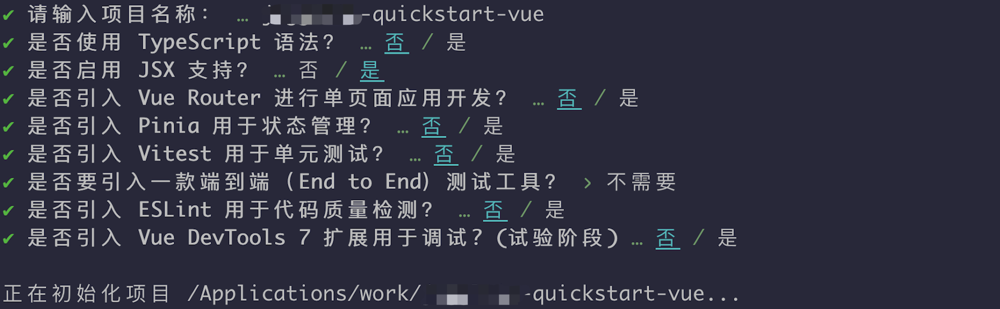

### 使用流程{#flow}


### 逐步集成{#step}

<Tabs
groupId="sdks-language"
values={[
{ label: '第 1 步', value: 'one', },
{ label: '第 2 步', value: 'two', },
{ label: '第 3 步', value: 'three', },
{ label: '第 4 步', value: 'four', },
]
}>
<TabItem value="one">

在 `开发者后台` 创建应用获取 `AppKey` 和 `Secret`。


</TabItem>
<TabItem value="two">

自己调用服务端 API 获取 Token 或在开发者后台的 -> 选择应用-> 开发工具 -> API -> 用户相关中，调用用户注册接口，获取两个测试 Token。


</TabItem>
<TabItem value="three">

1、使用 `Vue` 官方工具创建项目，执行命令逐步操作。

```shell
npm create vue@latest
```



2、进入项目目录安装 `Web IM SDK`

> 项目根目录执行 `npm install jugglechat-websdk --save`

</TabItem>
<TabItem value="four">

> 1、将下方代码复制粘贴到 `App.vue`

> 2、项目根目录执行 `npm run dev`

<br/>

```html
<script setup>
import JIM from "jugglechat-websdk";

// 准备基础信息
let appkey = "Your AppKey";
let token = "Your Token";

// 私有化部署后的 WebSocket 域名或 IP
let serverList = [
  'https://demo.im.com',
  'http://demo.im.com',
  'http://10.23.31.111:8080',
];
// 步骤 1: 初始化 SDK, 全局只需初始化一次
let jim = JIM.init({ appkey, serverList: serverList });
let { Event, ConnectionState, ConversationType, MessageType } = JIM;

// 步骤 2: 设置状态监听，全局只需设置一次
jim.on(Event.STATE_CHANGED, ({ state, user }) => {
  if (ConnectionState.CONNECTING == state) {
    console.log("im is connecting");
  }
  if (ConnectionState.CONNECTED == state) {
    // user => { id: 'xxx' }
    console.log("im is connected", user);
  }
  if (ConnectionState.DISCONNECTED == state) {
    console.log("im is disconnected");
  }
});

// 步骤 3: 设置消息监听，全局只需设置一次
jim.on(Event.MESSAGE_RECEIVED, message => {
  console.log(message);
});

// 步骤 4: 连接，全局只需调用一次，消息相关、会话相关接口必须连接成功后才可调用
jim.connect({ token }).then(
  result => {
    console.log(result);
  },
  error => {
    console.log(error);
  }
);
</script>

<template>
  <div class="container">请打开浏览器控制台查看结果</div>
</template>

<style scoped>
.container {
  height: 200px;
  width: 600px;
  background-color: rgb(119, 128, 226);
  margin: auto 200px;
  display: flex;
  align-items: center;
  justify-content: center;
  font-size: 40px;
  font-weight: bold;
  border-radius: 10px;
}
</style>

```
:::danger 要注意哦
Demo 里展示到连接成功，在实际项目中可根据 [集成文档](../../../sdkintro/init/) 按需选择使用 JIM 功能
:::

</TabItem>
</Tabs>
