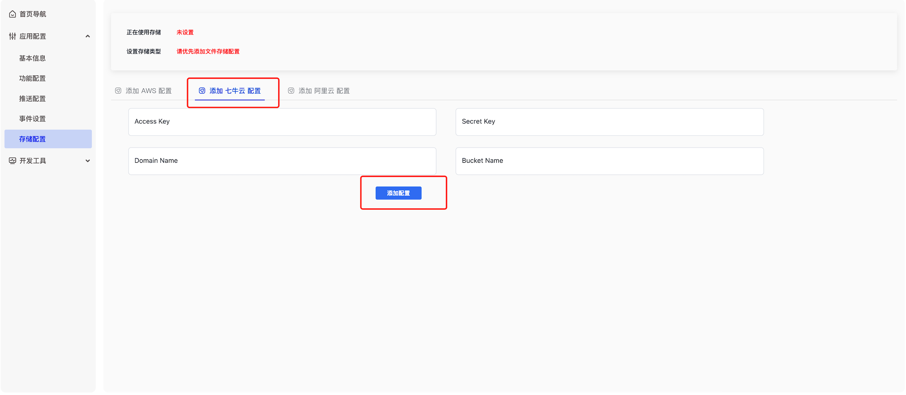

### Preparation{#pre}

Sending file messages, picture messages, video messages, and voice messages all require file uploads. This example uses file messages. The usage is similar; you only need to replace the sending message method and input parameters.

1. Create an application in the `Developer Backstage` to obtain your `AppKey` and `Secret`.


2. Call the server API to obtain the token yourself, or in the developer backend -> Select Application -> Development Tools -> API -> User Related, call the user registration interface to obtain two test tokens.


3. Download the latest version of the `JavaScript SDK`.

4. Download the cloud vendor file upload SDK, such as [Qiniu SDK](https://developer.qiniu.com/kodo/1283/javascript) or [Alibaba OSS](https://www.alibabacloud.com/help/zh/oss/user-guide/upload-a-file-using-a-file-url?spm=a2c63.p38356.0.0.55571f10Ci0gEp#392d9bf073h38). The following example uses Qiniu.

5. Set the cloud storage type in the developer backend. If you use Alibaba OSS, please configure the Alibaba Cloud backend to allow web-side cross-domain requests.



6. Integrate step-by-step according to the integration document.

### Use process{#flow}

> 1. Import the IM Web SDK

> 2. Import the Qiniu JS SDK

> 3. Initialize and configure the upload component

> 4. Establish a successful connection

> 5. Send a file message

### Sample code{#code}

For demonstration purposes, the sample code includes the official test AppKey and Token. Please replace them with your own AppKey and Token after testing.

> 1. Create a new `HTML` file named `demo.html`.

> 2. Download [juggleim-dev-1.9.0.zip](./juggleim-dev-1.9.0.zip) and place `juggleim-dev-1.9.0.js` in the same directory as `demo.html`.

> 3. Place [qiniu.min.js](https://developer.qiniu.com/kodo/1283/javascript) in the same directory as `demo.html`.

> 4. Copy and paste the code below into `demo.html`.

> 5. Open `demo.html` in the Chrome browser to preview the effect.

<br/>

```html
<!DOCTYPE html>
<html lang="en">
<head>
  <meta charset="UTF-8" />
  <title>JIM</title>
  <script src="./jim-[version].js"></script>
  <script src="./qiniu.min.js"></script>
  <style>
    .container {
      height: 200px;
      width: 600px;
      background-color: rgb(119, 128, 226);
      margin: 200px auto;
      font-size: 30px;
      font-weight: bold;
      border-radius: 10px;
      padding: 4rem;
      box-sizing: border-box;
    }

    .input {
      display: none;
      width: 100%;
    }
  </style>
</head>

<body>
  <div class="container">
    <div>Please open the browser console to view the results</div>
    <input type="file" id="file" class="input" />
    <div>
      <span id="percent">0</span>
      <span>%</span>
    </div>
  </div>
  <script>
    let fileNode = document.querySelector('#file');
    let percentNode = document.querySelector('#percent');

    // Prepare basic information
    let appkey = 'Your AppKey';
    let token = 'Your Token';
    let userId = 'userId matching the Token';
    // WebSocket domain name or IP after privatized deployment
    let serverList = [
      'https://demo.im.com',
      'http://demo.im.com',
      'http://10.23.31.111:8080',
    ];

    /*
    Initialize Qiniu file storage
    let jim = JIM.init({ appkey, upload: qiniu });
    */

    /*
    Initialize Ali file storage: OSS requires including https://gosspublic.alicdn.com/aliyun-oss-sdk-6.18.0.min.js by importing the Ali upload JS SDK
    let jim = JIM.init({ appkey, upload: OSS });
    */

    /*
    Initialize AWS file storage: S3Client is obtained by importing AWS JS SDK https://www.npmjs.com/package/@aws-sdk/client-s3
    import { S3Client } from "@aws-sdk/client-s3";
    let jim = JIM.init({ appkey, upload: S3Client });
    */

    // Step 1: Initialize the SDK. This only needs to be done once globally. Using Qiniu as an example.
    let jim = JuggleIM.init({ appkey, serverList, upload: qiniu });
    let { Event, ConnectionState, ConversationType, MessageType } = JIM;

    // Step 2: Set up status monitoring. This only needs to be done once globally.
    jim.on(Event.STATE_CHANGED, ({ state, user }) => {
      if (ConnectionState.CONNECTING === state) {
        console.log('IM is connecting');
      }
      if (ConnectionState.CONNECTED === state) {
        // user => { id: 'xxx' }
        console.log('IM is connected', user);
      }
      if (ConnectionState.DISCONNECTED === state) {
        console.log('IM is disconnected');
      }
    });

    // Step 3: Set up message monitoring. This only needs to be done once globally.
    jim.on(Event.MESSAGE_RECEIVED, (message) => {
      console.log(message);
    });

    // Step 4: Connect. This only needs to be called once globally. Message-related and session-related interfaces can only be called after a successful connection.
    jim.connect({ token, userId }).then(
      (user) => {
        fileNode.style.display = "block";
        fileNode.onchange = sendFile;
      },
      (error) => {
        console.log(error);
      }
    );

    function sendFile(e) {
      let file = e.target.files[0];
      let message = {
        conversationType: ConversationType.PRIVATE,
        conversationId: 'userid2',
        content: {
          file: file,
          name: file.name,
          type: file.type,
        },
        /*
        Custom attributes: used as needed. Custom attributes will be returned in the file upload progress onprogress and the msg object after the message is sent successfully.
        Usage scenario: When sending a file message, you can customize the tid, then render the message to the page through the returned value in onprogress.
        message.tid updates the progress bar.
        */
        tid: `tid_${Date.now()}`,
      };

      jim.sendFileMessage(message, {
        onprogress: ({ percent, message }) => {
          console.log(`${percent}%`, message);
          percentNode.innerHTML = percent;
        },
      }).then(
        (msg) => {
          console.log('File message sent successfully', msg);
          e.target.value = '';
        },
        (error) => {
          console.log(error);
        }
      );
    }
  </script>
</body>
</html>
```

:::danger Please be careful
The demo shows a successful connection. In an actual project, you can choose to use the JIM functions as needed according to the [Integration Document](../../../sdkintro/init/).
:::