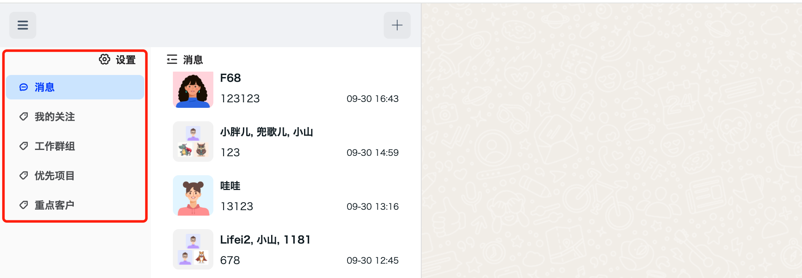

<Tabs
groupId="sdks-language"
values={[
{ label: 'Android', value: 'android', },
{ label: 'iOS', value: 'ios', },
{ label: 'JavaScript', value: 'js', },
{ label: 'Flutter', value: 'flutter', },
{ label: 'ReactNative', value: 'reactnative', }
]
}>
<TabItem value="android">

> Not yet provided

</TabItem>
<TabItem value="ios">

> Not yet provided

</TabItem>
<TabItem value="js">

Retrieve the list of tags created by the current user.



**Success Callback**

No parameters are returned; the callback is triggered to indicate success.

**Failure Callback**

| Name  | Type   | Description                                                                                  | Version |
|-------|--------|----------------------------------------------------------------------------------------------|---------|
| error | Object | Contains a status code if the request fails. You can access the error message via `error.msg`, or refer to [Status Code](../../status_code/web.md) for details. | 1.0.0   |

**Sample Code**
```js
jim.getConversationTags().then(({ tags }) => {
  /* tags => [{ id: 'tag_01', name: 'My attention' }, ... ] */
}, (error) => {
  console.log(error);
});
```
</TabItem>
<TabItem value="flutter" label="Flutter">

> Not yet provided

</TabItem>
<TabItem value="reactnative">

> Not yet provided

</TabItem>
</Tabs>
