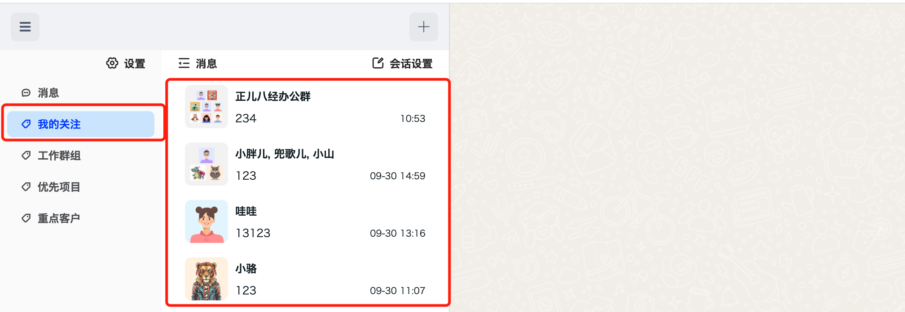

<Tabs
groupId="sdks-language"
values={[
{ label: 'Android', value: 'android', },
{ label: 'iOS', value: 'ios', },
{ label: 'JavaScript', value: 'js', },
{ label: 'Flutter', value: 'flutter', },
{ label: 'ReactNative', value: 'reactnative', }
]
}>
<TabItem value="android">

Retrieve the conversation list under a specific tag, with support for pagination.

**Sample Code**

```java
GetConversationOptions o = new GetConversationOptions();
o.setCount(20);
o.setTimestamp(0);
o.setPullDirection(JIMConst.PullDirection.OLDER);
o.setTagId("Tag111");
List<ConversationInfo> infoList = JIM.getInstance().getConversationManager().getConversationInfoList(o);
```


</TabItem>
<TabItem value="ios">

Retrieve the conversation list under a specific tag, with support for pagination.

**Sample Code**


```objectivec
JGetConversationOptions *o = [[JGetConversationOptions alloc] init];
o.tagId = @"Tag111";
o.count = 20;
o.timestamp = 0;
o.direction = JPullDirectionOlder;
NSArray *arr = [JIM.shared.conversationManager getConversationInfoListWith:o];
```

</TabItem>
<TabItem value="js">

Retrieve the conversation list under a specific tag, with support for pagination.



**Parameter Description**

| Name | Type | Required | Default | Description | Version |
|--------------|---------|----------|----------------------------------|------------------------------------------------|----------|
| option | Object | Yes | | | 1.7.5 |
| option.tag | String | Yes | | | 1.7.5 |
| option.count | Number | No | 50 | Number of sessions to retrieve, up to 100 sessions per request | 1.0.0 |
| option.order | Number | No | [FORWARD](../../../enum/web#conversation) | Direction of retrieval; supports fetching earlier or newer sessions, used with the `time` attribute | 1.0.0 |
| option.time | Number | No | 0 | Starting point in time to retrieve sessions. Use with `order` to fetch newer or older sessions | 1.0.0 |

**Callback Description**

| Properties | Type | Description | Version |
|------------------|----------|------------------------------------------------|----------|
| result | Object | Query result | 1.0.0 |
| result.conversations | Array | Array of conversations. See [Conversation](../../conversation.mdx) for the structure of a single conversation object | 1.0.0 |
| result.isFinished | Boolean | Indicates whether all sessions have been retrieved | 1.0.0 |

**Sample Code**
```js
/* 
Assuming the current user has 199 sessions, and each page retrieves 50 items. The session list is ordered in reverse chronological order. The pagination logic is as follows:
1. Load page 1 with parameters: { count: 50, time: 0 }
2. Load page 2 with parameters: { count: 50, time: 'Smallest sortTime in the session array on page 1 (session with the highest array index)' }
3. Load page 3 with parameters: { count: 50, time: 'Smallest sortTime in the session array on page 2 (session with the highest array index)' }
4. Load page 4 with parameters: { count: 50, time: 'Smallest sortTime in the session array on page 3 (session with the highest array index)' }
5. End: When isFinished returns true, stop loading.
*/

let option = {
  tag: 'tag_01'
}
jim.getConversations(option).then((result) => {
  let { conversations, isFinished } = result;
  console.log(isFinished, conversations);
})
```
</TabItem>
<TabItem value="flutter" label="Flutter">

> Not yet provided

</TabItem>
<TabItem value="reactnative">

Retrieve the conversation list under a specific tag, with support for pagination.

**Parameter Description**

| Name | Type | Required | Default | Description | Version |
|--------------|---------|----------|------------|------------------------------------------------|----------|
| tag | String | Yes | None | Tag ID | 0.6.3 |
| count | Number | No | 50 | Number of sessions to retrieve, up to 100 sessions per request | 0.6.3 |
| timestamp | Number | No | 0 | Starting point in time to retrieve sessions | 0.6.3 |
| direction | Number | No | 1 | Retrieval direction: 0 to pull sessions after the timestamp, 1 to pull sessions before the timestamp | 0.6.3 |

**Sample Code**

```javascript
import JuggleIM from 'juggleim-rnsdk';

const conversations = await JuggleIM.getConversationInfoList({
  tag: 'tag_01',
  count: 50,
  timestamp: 0,
  direction: 1
});
```

</TabItem>
</Tabs>