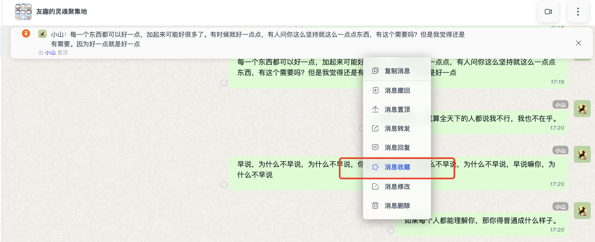

<Tabs
groupId="sdks-language"
values={[
{ label: 'Android', value: 'android', },
{ label: 'iOS', value: 'ios', },
{ label: 'JavaScript', value: 'js', },
{ label: 'Flutter', value: 'flutter', },
{ label: 'ReactNative', value: 'reactnative', }
]
}>
<TabItem value="android">

Add messages to favorites to support collecting various types of content such as pictures, files, voice notes, videos, and more.

**Interface definition**

```java
/**
 * Add messages to favorites
 * @param messageIdList List of message IDs to be added to favorites
 * @param callback Result callback
 */
void addFavorite(List<String> messageIdList, ISimpleCallback callback);
```

</TabItem>
<TabItem value="ios">

Add messages to favorites to support collecting various types of content such as pictures, files, voice notes, videos, and more.

**Interface definition**

```objectivec
/// Add messages to favorites
/// - Parameters:
///   - messageIdList: List of message IDs to be added to favorites
///   - successBlock: Success callback
///   - errorBlock: Failure callback
- (void)addFavorite:(NSArray <NSString *> *)messageIdList
            success:(void (^)(void))successBlock
              error:(void (^)(JErrorCode code))errorBlock;
```

</TabItem>
<TabItem value="js">

Add messages to favorites to support collecting various types of content such as pictures, files, voice notes, videos, and more.



**Parameter description**

| Name | Type | Required | Default | Description | Version |
|----------------------------------------|---------|--------|--------|---------------------------------------------------------|----------|
| params | Object | Yes | | Message object | 1.0.0 |
| params.messages | Array | Yes | | List of messages to be favorited | 1.0.0 |
| params.messages[0].conversationType | Number | Yes | | [Conversation Type](../../enum/web.md#conversation) | 1.0.0 |
| params.messages[0].conversationId | String | Yes | | Session ID. For `PRIVATE` conversations, this is the receiver's userId; for `GROUP` conversations, this is the group ID | 1.0.0 |
| params.messages[0].senderId | String | Yes | | Message sender ID, see [Message.sender.id](../../msg/message.md) | 1.0.0 |
| params.messages[0].messageId | String | Yes | | Message ID, see [Message.messageId](../../msg/message.md) | 1.0.0 |

**Success callback**

No parameters are returned. The callback is triggered to indicate success.

**Failure callback**

| Name | Type | Description | Version |
|--------|---------|--------------------------------------------------------------|--------|
| error | Object | Contains the error status code upon failure. You can check `error.msg` or refer to [Status Code](../../status_code/web.md) | 1.0.0 |

**Sample Code**
```js
let { ConversationType } = JIM;

let params = {
  messages: [{
    conversationType: ConversationType.GROUP,
    conversationId: 'groupz001',
    messageId: 'nwmz3nrps6yj3rk8',
    senderId: "675NdFjkx"
  }] 
};

jim.addFavoriteMessages(params).then(() => {
  console.log('addFavoriteMessages succeeded.');
}, (error) => {
  console.log(error);
});
```
</TabItem>
<TabItem value="flutter">

Add messages to favorites to support collecting various types of content such as pictures, files, voice notes, videos, and more.

**Interface definition**

```dart
/// Add messages to favorites
/// - Parameters:
///   - messageIdList: List of message IDs to be added to favorites
Future<int> addFavoriteMessages(List<String> messageIdList) async
```

</TabItem>
</Tabs>
