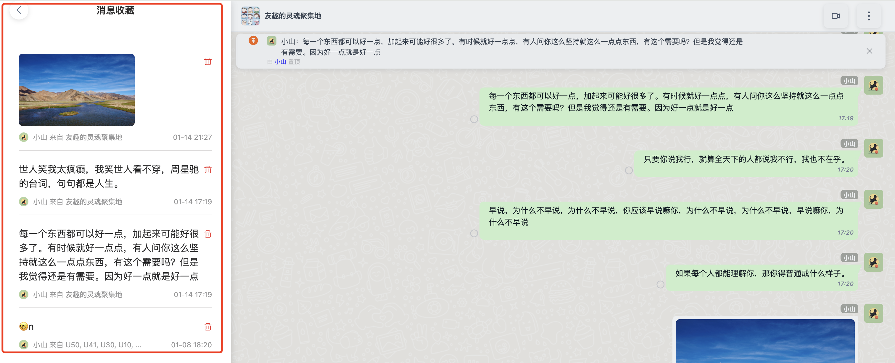

<Tabs
groupId="sdks-language"
values={[
{ label: 'Android', value: 'android', },
{ label: 'iOS', value: 'ios', },
{ label: 'JavaScript', value: 'js', },
{ label: 'Flutter', value: 'flutter', },
{ label: 'ReactNative', value: 'reactnative', }
]
}>
<TabItem value="android">

Query the collection list, sorted in reverse chronological order, with support for `count` and `offset` pagination.

**Interface definition**

```java
/**
 * Retrieve favorite news
 * @param option Query parameters
 * @param callback Result callback
 */
void getFavorite(GetFavoriteMessageOption option, IGetFavoriteMessageCallback callback);
```

</TabItem>
<TabItem value="ios">

Query the collection list, sorted in reverse chronological order, with support for `count` and `offset` pagination.

**Interface definition**

```objectivec
/// Retrieve favorited messages
/// - Parameters:
///   - option: Query parameters
///   - successBlock: Success callback
///   - errorBlock: Failure callback
- (void)getFavorite:(JGetFavoriteMessageOption *)option
            success:(void (^)(NSArray <JFavoriteMessage *> *messageList, NSString *offset))successBlock
              error:(void (^)(JErrorCode code))errorBlock;
```

</TabItem>
<TabItem value="js">

Query the collection list, sorted in reverse chronological order, with support for `limit` and `offset` pagination.



**Parameter description**

| Name | Type | Required | Default | Description | Version |
|--------------------------|---------|--------|--------|------------------------------------------------------------------|----------|
| params | Object | Yes | | Parameter object | 1.0.0 |
| message.limit | Number | No | 20 | Number of items per query | 1.0.0 |
| message.offset | String | No | Empty | Default is empty. After a successful query, an `offset` is returned. Pass this `offset` in subsequent queries to retrieve the next set of results. | 1.0.0 |

**Successful callback**

| Name | Type | Description | Version |
|------------------------|---------|-----------------------------------------|--------|
| result | Object | | 1.0.0 |
| result.offset | String | Pagination identifier. Pass this `offset` to retrieve additional favorite messages. | 1.0.0 |
| result.list | Array | Collection list. When `list.length` is less than or equal to `limit`, it indicates all data has been fetched. In this case, `offset` will be an empty string. | 1.0.0 |
| result.list[0] | Object | Favorite [message object](../../msg/message.md) entries | 1.0.0 |

**Failure callback**

| Name | Type | Description | Version |
|--------|---------|--------------------------------------------------------------|--------|
| error | Object | Contains the status code if the request fails. You can check `error.msg` directly or refer to [Status Code](../../status_code/web.md) for details. | 1.0.0 |

**Sample Code**
```js
let params = {
  offset: '',
  limit: 20
};

jim.getFavoriteMessages(params).then((result) => {

  let { offset, list } = result;

  // offset => pagination identifier
  
  // list => Favorite message list

}, (error) => {
  console.log(error);
});
```
</TabItem>
<TabItem value="flutter">

Query the collection list, sorted in reverse chronological order, with support for `count` and `offset` pagination.

**Interface definition**

```dart
/// Retrieve favorited messages
/// - Parameters:
///   - option: Query parameters
Future<Result<FavoriteMessageResult>> getFavoriteMessages(GetFavoriteMessageOption option) async
```

</TabItem>
</Tabs>
