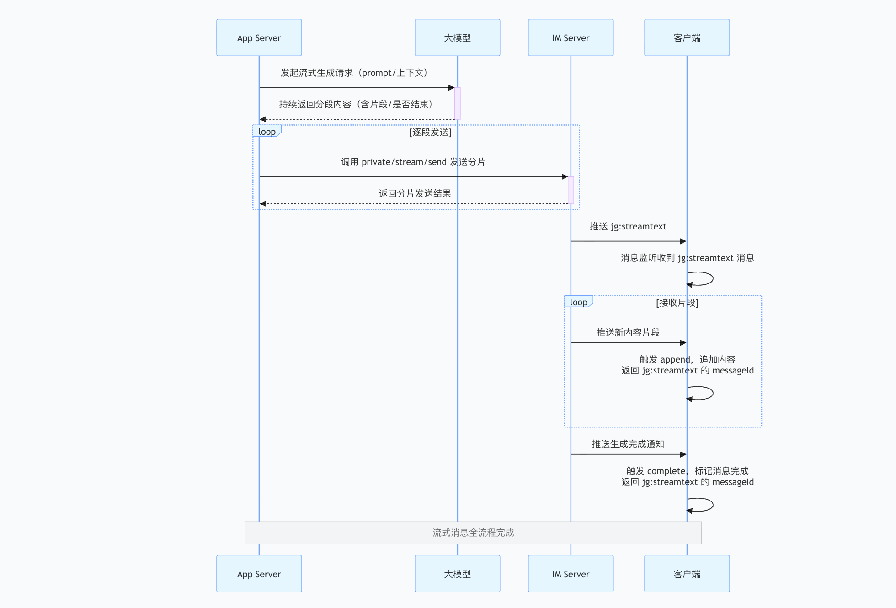

> 1. `App Server` requests content generation from the large model: The `App Server` initiates a streaming generation request to the large model, providing prompt and context information. The large model continuously returns segmented content, with each segment containing the actual content and an indicator of whether it has finished.

> 2. `App Server` sends segments one by one: Based on the large model's response, the `App Server` calls the [SendStream](../../../../server/message/streammsg/sendstreammsg) interface of the `IM Server` to send each segment. After each call, it receives the result of the segment transmission.

> 3. IM pushes the initial message: When `seq = 1` and `is_finished = false`, the `App Server` calls the [SendStream](../../../../server/message/streammsg/sendstreammsg) interface. The `IM Server` then pushes a message of type `jg:streamtext` to the client. The client receives this streaming message during message listening.

> 4. The client receives fragments and appends them: The `IM Server` continuously pushes new content fragments to the client. Each time the client receives a fragment, it triggers the `append` event, appends the content to the message, and returns the `messageId` of the `jg:streamtext` message.

> 5. Completion notification: After the large model finishes generating content, the `App Server` sets `seq` to the sequence number of the last segment and `is_finished = true`, then calls the [SendStream](../../../../server/message/streammsg/sendstreammsg) interface. The `IM Server` pushes a generation completion notification to the client, which triggers the `complete` event.

<br/>


:::caution The following special cases do not require additional handling at the business layer:

**1. Disconnection and reconnection**: The SDK automatically receives any missed `new fragments` during disconnection and delivers them to the business layer for processing.

**2. Process termination or browser closure after generation starts**: Users can still receive the complete generated content or the `generating fragment` upon reconnecting.

**3. Automatic synchronization of user-generated content across multiple devices**: For example, content generated by user A on iOS is visible when logging in on the web. If generation is in progress, synchronous updates are supported.

**4. Content generation timeout**: After the `App Server` starts sending streaming messages, if `is_finished = true` is not set within the default timeout of 10 minutes, the generation will be automatically completed, and the content may be partial.

**5. Retrieving historical messages**: User-generated messages can be obtained directly through the historical message retrieval interface on each client. The complete message content is assembled, allowing the business layer to display it according to the message type.

:::

<Tabs
groupId="sdks-language"
values={[
{ label: 'Android', value: 'android', },
{ label: 'iOS', value: 'ios', },
{ label: 'JavaScript', value: 'js', },
{ label: 'ReactNative', value: 'reactnative', }
]
}>
<TabItem value="android">

```java
JIM.getInstance().getMessageManager().addListener("main", new IMessageManager.IMessageListener() {
    /// Callback for receiving messages
    @Override
    public void onMessageReceive(Message message) {
        MessageContent content = message.getContent();
        if (content instanceof StreamTextMessage) {
            Log.d("TAG", "Stream message received, content is " + ((StreamTextMessage) content).getContent());
        }
    }
});

JIM.getInstance().getMessageManager().addStreamMessageListener("main", new IMessageManager.IStreamMessageListener() {
    @Override
    public void onStreamTextMessageAppend(String messageId, String content) {
        // messageId: the message ID of the corresponding streaming message
        // content: content appended in fragments. Developers can append this content to the end of the StreamTextMessage content in the interface.
    }

    @Override
    public void onStreamTextMessageComplete(Message message) {
        // message: complete streaming message object
    }
});
```

</TabItem>
<TabItem value="ios">

```objectivec
// Message receiving delegate
[JIM.shared.messageManager addDelegate:self];
// Streaming message delegate
[JIM.shared.messageManager addStreamMessageDelegate:self];

#pragma mark - JMessageDelegate
/// Callback for receiving messages
- (void)messageDidReceive:(JMessage *)message {
    JMessageContent *content = message.content;
    if ([content isKindOfClass:[JStreamTextMessage class]]) {
        NSLog(@"Stream message received, content is %@", ((JStreamTextMessage *)content).content);
    }
}

#pragma mark - JStreamMessageDelegate
- (void)streamTextMessageDidAppend:(NSString *)messageId content:(NSString *)content {
    // messageId: the message ID of the corresponding streaming message
    // content: content appended in fragments. Developers can append this content to the end of the JStreamTextMessage content in the interface.
}

- (void)streamTextMessageDidComplete:(JMessage *)message {
    // message: complete streaming message object
}
```

</TabItem>
<TabItem value="js">

```js
let { Event, MessageType } = JIM;

// Register once globally to listen consistently at the message listening point. Placed here for clarity.

jim.on(Event.MESSAGE_RECEIVED, (message) => {
  if (message.name === MessageType.STREAM_TEXT) {
    console.log('Received a stream message', message);
  }
  // ... handle other message types
});

jim.on(Event.STREAM_APPENDED, (notify) => {
  // notify => { content: 'New content fragment', messageId: 'messageId of MessageType.STREAM_TEXT' }
  console.log('Event.STREAM_APPENDED', notify);
});

jim.on(Event.STREAM_COMPLETED, (notify) => {
  // notify => { content: 'Complete generated content', messageId: 'MessageType.STREAM_TEXT' }
  console.log('Event.STREAM_COMPLETED', notify);
});
```

</TabItem>
<TabItem value="reactnative" label="ReactNative">


> Streaming messaging is used in scenarios such as AI assistants and supports real-time text streaming output.
> To achieve a typing effect, you can enqueue the StreamTextMessageContent message.
> After enqueuing and continuously appending via append, you can process the queue word by word to simulate typing.

* After receiving a message, if it is a stream message `jg:streamtext` and not completed,
* Subsequent stream messages are notified via `onStreamTextMessageAppend`,
* Until the stream message is completed and `onStreamTextMessageComplete` is triggered.

```javascript
// Message receive listener
JuggleIM.addMessageListener('MessageListScreen', {
  onMessageReceive: (message: Message) => {
    // Handle message
  }
});

/**
* Streaming message event listener
 * Listens for append and completion events of streaming messages
 */
const unsubscribe = JuggleIM.addStreamMessageListener('stream_listener_key', {
  /**
   * Callback for appending streaming message fragments
   * @param {string} messageId - the message ID of the streaming message
   * @param {string} content - content appended in fragments. Developers can append this content to the end of the StreamTextMessage content in the interface.
   */
  onStreamTextMessageAppend: (messageId, content) => {
    console.log('Stream message append:', messageId, content);
    // Append content to UI to achieve a typewriter effect
  },
  
  /**
   * Callback when streaming message is complete
   * @param {Message} message - complete streaming message
   */
  onStreamTextMessageComplete: (message) => {
    console.log('Stream message complete:', message);
    // Update UI to display full message
  }
});

// To cancel listening
// unsubscribe();

/**
 * Streaming text message content: jg:streamtext
 * Streaming messages are used in scenarios such as AI assistants, with content appended in fragments.
 * @property {string} content - message content
 * @property {boolean} isFinished - whether the message is complete
 * @property {number} seq - streaming message sequence number
 */
export class StreamTextMessageContent extends MessageContent {
    contentType: string;
    content: string;
    isFinished: boolean;
    seq: number;
}
```

</TabItem>
</Tabs>
