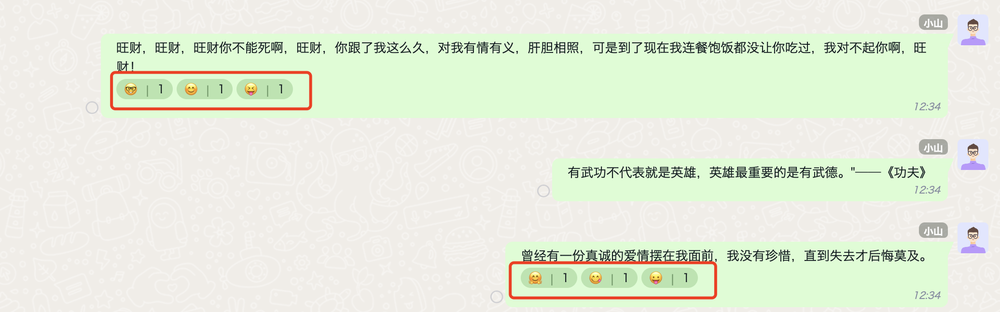

<Tabs
groupId="sdks-language"
values={[
{ label: 'Android', value: 'android', },
{ label: 'iOS', value: 'ios', },
{ label: 'JavaScript', value: 'js', },
{ label: 'Flutter', value: 'flutter', },
{ label: 'ReactNative', value: 'reactnative', },
]
}>
<TabItem value="android">

Message reactions refer to replying to a message using emoticons or special symbols, such as `like`, `wry smile`, etc.

The message reaction callbacks are integrated into the [Message Listener](../../../watcher/message).

```java
JIM.getInstance().getMessageManager().addListener("main", new IMessageManager.IMessageListener() {
    /// Callback for adding a message reaction
    /// conversation: the conversation to which it belongs
    /// reaction: the new message reaction
    @Override
    public void onMessageReactionAdd(Conversation conversation, MessageReaction reaction) {

    }

    /// Callback for removing a message reaction
    /// conversation: the conversation to which it belongs
    /// reaction: the removed message reaction
    void onMessageReactionRemove(Conversation conversation, MessageReaction reaction) {

    }
});

```

</TabItem>
<TabItem value="ios">

Message reactions refer to replying to a message using emoticons or special symbols, such as `like`, `wry smile`, etc.

The message reaction callbacks are integrated into the [Message Listener](../../../watcher/message).

```objectivec
[JIM.shared.messageManager addDelegate:self];

/// Callback for adding a message reaction
/// - Parameter reaction: the new message reaction
/// - Parameter conversation: the conversation to which it belongs
- (void)messageReactionDidAdd:(JMessageReaction *)reaction
               inConversation:(JConversation *)conversation {

}

/// Callback for removing a message reaction
/// - Parameter reaction: the removed message reaction
/// - Parameter conversation: the conversation to which it belongs
- (void)messageReactionDidRemove:(JMessageReaction *)reaction
                  inConversation:(JConversation *)conversation {
  
}
```

</TabItem>
<TabItem value="js">

Message reactions refer to replying to a message using emoticons or special symbols, such as `like`, `wry smile`, etc. After setting a message reaction, the message will automatically include the `reactions` attribute, which reflects everyone's responses to the current message in an array. Developers can display the UI using the `reactions` attribute, as shown below:



There are two ways to obtain message reactions: `Historical messages` and `Message reaction events`. The differences are as follows:

> **Historical Messages**: Retrieves the latest complete list of message reactions. The cloud automatically updates and maintains this list when the user is offline.

> **Reaction Events**: Incremental synchronization of changes while the user is online. If a user adds or removes a reaction, an event is triggered. _Adding or deleting a reaction by yourself does not trigger a reaction event._

**Sample Code**

```js
let { Event } = JIM;

// Register this globally once; it can be placed alongside message listeners for consistency. Here it is shown for clarity.

jim.on(Event.MESSAGE_REACTION_CHANGED, (notify) => {
  /* 
Processing logic: Developers only need to update the message reactions in memory. The cloud and local SDK will update automatically, and retrieving historical messages will return the latest reaction data.
Example notify object:
      {
        conversationId: "qEqA0i9C2pg",
        conversationType: 2,
        messageId: "nxe3swhgabukvd8k",
        reactions: [
          {
            isRemove: false,
            // Key for adding or deleting
            key: ':smile',
            value: 'User Id',
            timestamp: 1740177311973,
            user: {
              id: 'User ID',
              name: 'nickname',
              portrait: 'avatar'
            }
          }
        ]
      }
    */
  console.log(notify);
});

```
</TabItem>

<TabItem value="flutter">

Message reactions refer to replying to a message using emoticons or special symbols, such as `like`, `wry smile`, etc.

The message reaction callbacks are integrated into the [Message Listener](../../../watcher/message).

```java
/// Callback for adding a message reaction
/// conversation: the conversation to which it belongs
/// reaction: the new message reaction
JuggleIm.instance.onMessageReactionAdd = (conversation, reaction) {

};
/// Callback for removing a message reaction
/// conversation: the conversation to which it belongs
/// reaction: the removed message reaction
JuggleIm.instance.onMessageReactionRemove = (conversation, reaction) {

};

```

</TabItem>
</Tabs>