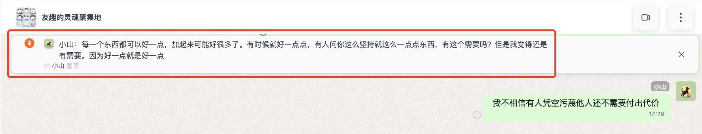

<Tabs
groupId="sdks-language"
values={[
{ label: 'Android', value: 'android', },
{ label: 'iOS', value: 'ios', },
{ label: 'JavaScript', value: 'js', },
{ label: 'Flutter', value: 'flutter', },
{ label: 'ReactNative', value: 'reactnative', }
]
}>
<TabItem value="android">

The callback for message pinning is integrated into the [Message event listener](../../watcher/message.md).

```java
JIM.getInstance().getMessageManager().addListener("main", new IMessageManager.IMessageListener() {
    /// Callback for message pinning
    /// message: the corresponding message
    /// operator: the user performing the pin operation
    /// isTop: true means pinned, false means unpinned
    void onMessageSetTop(Message message, UserInfo operator, boolean isTop) {

    }
});
```

</TabItem>
<TabItem value="ios">

The callback for message pinning is integrated into the [Message event listener](../../watcher/message.md).

```objectivec
[JIM.shared.messageManager addDelegate:self];

/// Callback for message pinning
/// - Parameters:
///   - isTop: YES means pinned, NO means unpinned.
///   - message: the corresponding message
///   - userInfo: the user who performed the pin operation
- (void)messageDidSetTop:(BOOL)isTop
                 message:(JMessage *)message
                    user:(JUserInfo *)userInfo {
  
}
```

</TabItem>
<TabItem value="js">

The pinned message callback is triggered after a message in the session is pinned or unpinned. Pinning actions performed by yourself or others in the session will trigger this event, allowing you to handle UI updates accordingly.



```js
let { Event } = JIM;

jim.on(Event.MESSAGE_SET_TOP, ({ message, isTop, operator, createdTime }) => {
  
  // message => The original message that was pinned or unpinned. You can inspect the Message object if needed.
  
  // isTop => Indicates whether the message is pinned (true) or unpinned (false)
  
  // operator => The user who performed the operation { id: '', name: '', portrait: '' }
  
  // createdTime => The time when the operation occurred

});
```

</TabItem>
<TabItem value="flutter">

The callback for message pinning is integrated into the [Message event listener](../../watcher/message.md).

```dart
/// Callback for message pinning
/// message: the corresponding message
/// operator: the user performing the pin operation
/// isTop: true means pinned, false means unpinned
JuggleIm.instance.onMessageSetTop = (message, operator, isTop) {

};
```

</TabItem>
</Tabs>
