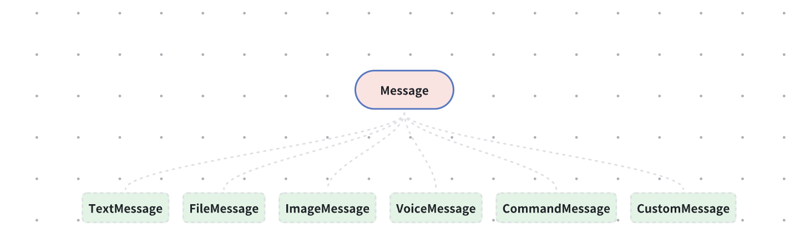

---
title: Message Object
hide_title: true
sidebar_position: 1
---

The message object `Message` is a general message object encapsulated by the SDK. `Message` acts more like a base class, and **Message.content** represents specific subclasses, such as `text message`, `image message`, etc.



<Tabs
groupId="sdks-language"
values={[
{ label: 'Android', value: 'android', },
{ label: 'iOS', value: 'ios', },
{ label: 'JavaScript', value: 'js', },
{ label: 'Flutter', value: 'flutter', },
{ label: 'ReactNative', value: 'reactnative', },
]}
>
<TabItem value="android">

| Property | Type | Description | Version |
| ------------ | ----------------- | ------------------------------------------------------------ | ----- |
| conversation | [Conversation](#conversation)     | The conversation to which the message belongs                | 1.0.0 |
| contentType  | String          | Message type (e.g., text message, image message)             | 1.0.0 |
| content      | [MessageContent](#messagecontent)   | Message content, related to the contentType property. For example, when contentType is `jg:text`, content is a [text message](./text.md) | 1.0.0 |
| messageId    | String          | Message ID, a globally unique identifier for each message    | 1.0.0 |
| clientMsgNo  | long         | Unique message number on the client side (corresponds to the local database unique ID) | 1.0.0 |
| direction    | [MessageDirection](#messagedirection) | Message direction, indicating whether the message is received or sent | 1.0.0 |
| state | [MessageState](#messagestate)     | Message state, indicating whether the message is sending, sent successfully, or failed | 1.0.0 |
| hasRead      | boolean              | Whether the message has been read                             | 1.0.0 |
| timestamp    | long         | Message sending time as a timestamp in milliseconds (server time) | 1.0.0 |
| senderUserId | String          | User ID of the message sender                                 | 1.0.0 |
| referredMessage | Message   | Referenced message                                           | 1.0.0 |
| mentionInfo | [MessageMentionInfo](#messagementioninfo) | @ mention information                                       | 1.0.0 |
| localAttribute | String | Local message attribute (effective only on the client side, not synchronized to the server) | 1.0.0 |
| groupMessageReadInfo | [GroupMessageReadInfo](#groupmessagereadinfo) | Group message read information (effective only for group messages) | 1.0.0 |
| isEdit | boolean | Whether the message has been edited                            | 1.0.0 |
| isDeleted | boolean | Whether the message has been deleted                           | 1.0.0 |
| destroyTime | long | Message destruction timestamp (server time in milliseconds). Default is 0, meaning no auto-destruction. | 1.0.0 |
| lifeTimeAfterRead | long | Message lifetime after being read, in milliseconds. Default is 0, meaning no auto-destruction after reading. | 1.0.0 |
| senderDisplayName | String          | Sender's display name (shown according to default rules)      | 1.8.39 |
| friendAlias | String          | Sender's friend remark                                        | 1.8.39 |
| groupMemberAlias | String          | Sender's group member remark                                  | 1.8.39 |
| senderName | String          | Sender's real name                                            | 1.8.39 |
| senderPortrait | String          | Sender's avatar URL                                           | 1.8.39 |

</TabItem>
<TabItem value="ios">

| Property | Type | Description | Version |
| ------------ | ----------------- | ------------------------------------------------------------ | ----- |
| conversation | JConversation     | The conversation to which the message belongs                | 1.0.0 |
| contentType  | NSString          | Message type (e.g., text message, image message)             | 1.0.0 |
| content      | JMessageContent   | Message content, related to the contentType property. For example, when contentType is `jg:text`, content is a [text message](./text.md) | 1.0.0 |
| messageId    | NSString          | Message ID, a globally unique identifier for each message    | 1.0.0 |
| clientMsgNo  | long long         | Unique message number on the client side (corresponds to the local database unique ID) | 1.0.0 |
| direction    | JMessageDirection | Message direction, indicating whether the message is received or sent | 1.0.0 |
| messageState | JMessageState     | Message state, indicating whether the message is sending, sent successfully, or failed | 1.0.0 |
| hasRead      | BOOL              | Whether the message has been read                             | 1.0.0 |
| timestamp    | long long         | Message sending time as a timestamp in milliseconds (server time) | 1.0.0 |
| senderUserId | NSString          | User ID of the message sender                                 | 1.0.0 |
| referredMsg | Message   | Referenced message                                           | 1.0.0 |
| mentionInfo | MessageMentionInfo | @ mention information                                       | 1.0.0 |
| localAttribute | String | Local message attribute (effective only on the client side, not synchronized to the server) | 1.0.0 |
| groupReadInfo | JGroupMessageReadInfo | Group message read information (effective only for group messages) | 1.0.0 |
| isEdit | BOOL | Whether the message has been edited                            | 1.0.0 |
| isDeleted | BOOL | Whether the message has been deleted                           | 1.0.0 |
| destroyTime | long long | Message destruction timestamp (server time in milliseconds). Default is 0, meaning no auto-destruction. | 1.0.0 |
| lifeTimeAfterRead | long long | Message lifetime after being read, in milliseconds. Default is 0, meaning no auto-destruction after reading. | 1.0.0 |
| senderDisplayName | NSString          | Sender's display name (shown according to default rules)      | 1.8.39 |
| friendAlias | NSString          | Sender's friend remark                                        | 1.8.39 |
| groupMemberAlias | NSString          | Sender's group member remark                                  | 1.8.39 |
| senderName | NSString          | Sender's real name                                            | 1.8.39 |
| senderPortrait | NSString          | Sender's avatar URL                                           | 1.8.39 |

</TabItem>
<TabItem value="js">

| Property | Type | Description | Version |
|------------------|-----------|-----------------------------------------------------|----------|
| conversationId    | String   | Conversation ID. For `PRIVATE` conversations, this is the recipient's userId; for `GROUP` conversations, it is the group ID | 1.0.0    |
| conversationType  | Number   | Conversation type                                    | 1.0.0    |
| conversationTitle    | String   | Conversation name. To modify the conversation name, directly update the user or group name | 1.0.0    |
| conversationPortrait | String   | Conversation avatar. To modify the avatar, directly update the user or group avatar | 1.0.0    |
| conversationExts    | Object   | Conversation extensions. To modify, directly update the user or group extensions | 1.0.0    |
| tid              | String    | Locally generated temporary message ID. Sending messages is asynchronous; both successful sending and the `onbefore` event return `tid` to match and update the message sending status in the UI | 1.0.0    |
| messageId        | String    | Server-generated message ID, a globally unique identifier | 1.0.0    |
| name             | String    | Message name, used for UI display after sending and receiving | 1.0.0    |
| content          | Object    | Message content, related to the name property. For example, when name is `jg:text`, content is a [text message](./text.md) | 1.0.0    |
| sentState        | Number    | Message [sending state](../enum/web.md#msg_sent)    | 1.0.0    |
| sentTime         | Number    | Message sending time as a timestamp in milliseconds, used for UI display | 1.0.0    |
| sender           | Object    | Information about the message sender                  | 1.0.0    |
| sender.id        | String    | Sender's ID. [Use API to update](../../../server/user/updateuser.md) | 1.0.0    |
| sender.name      | String    | Sender's name. [Use API to update](../../../server/user/updateuser.md) | 1.0.0    |
| sender.portrait  | String    | Sender's avatar. [Use API to update](../../../server/user/updateuser.md) | 1.0.0    |
| sender.exts      | Object    | User extension fields. [Use API to update](../../../server/user/updateuser.md) | 1.0.0    |
| attribute        | String    | Effective in `Electron`, local message extension attribute, e.g., storing local file URLs. Can be modified via [Update Local Message Extension](../message/operator/update_lc_attr.md) | 1.0.0    |
| reactions        | Object    | Message reactions                                     | 1.8.0    |
| mentionInfo      | Object    | @ mention information                                | 1.0.0    |
| mentionInfo.mentionType      | Number    | @ all or @ specific users. See [MentionType](../enum/web.md#mention) for enum values | 1.0.0    |
| mentionInfo.members      | Array    | List of mentioned users, present when @ specific users is used, includes `id`, `name`, and `portrait` | 1.0.0    |
| referMsg         | Object    | Referenced or replied message content, including sender information. See [Message](./message.md) object for details | 1.0.0    |
| isMass           | Boolean   | Whether the message is a [mass message](../message/msg_send/send_mass.md) | 1.0.0    |
| isUpdated        | Boolean   | Whether the message has been edited                   | 1.0.0    |
| isSender         | Boolean   | Whether the current user is the sender of this message, e.g., for UI layout where sent messages appear on the right and received messages on the left | 1.0.0    |
| isRead           | Boolean   | Effective in one-on-one conversations, indicates whether the recipient has read the message | 1.0.0    |
| readCount        | Number    | Effective in group conversations, indicates the number of users who have read the message, based on the group size at the time of sending; does not change with group membership | 1.0.0    |
| unreadCount      | Number    | Effective in group conversations, indicates the number of users who have not read the message, based on the group size at the time of sending; does not change with group membership | 1.0.0    |
| destroyTime      | Number    | Message destruction timestamp. A value greater than `0` indicates the message will be destroyed, e.g., if a destruction time was set when sending | 1.9.0    |
| lifeTimeAfterRead| Number    | Message self-destruct time after being read. A value greater than `0` indicates a burn-after-reading message, e.g., destroy 1 minute after reading, unit is `ms`, value is `1 * 60 * 1000` | 1.9.0    |
| friendAlias    | String   | Friend remark name                                     | 1.9.7    |

**Explanation of reactions:**
```js
let message = {
  // properties
  reactions: {
    // :smile is a custom key used when adding a reaction
    :smile: [{
      key: 'key set when reacting to the message',
      value: 'user ID who triggered the reaction',
      timestamp: 'reaction time in milliseconds',
      // User information of the person who triggered the reaction
      user: {
        id: 'user ID who triggered the reaction',
        name: 'user name who triggered the reaction',
        portrait: 'user avatar who triggered the reaction'
      }
    }],
  }
};
```

</TabItem>

<TabItem value="flutter">

| Property | Type | Description | Version |
| ------------ | ----------------- | ------------------------------------------------------------ | ----- |
| conversation | Conversation     | The conversation to which the message belongs                | 0.0.63 |
| contentType  | String          | Message type (e.g., text message, image message)             | 0.0.63 |
| content      | MessageContent   | Message content, related to the contentType property. For example, when contentType is `jg:text`, content is a [text message](./text.md) | 0.0.63 |
| messageId    | String          | Message ID, a globally unique identifier for each message    | 0.0.63 |
| clientMsgNo  | int         | Unique message number on the client side (corresponds to the local database unique ID) | 0.0.63 |
| direction    | int | Message direction, indicating "received message (2)" or "sent message (1)" | 0.0.63 |
| messageState | int     | Message state, indicating "sending (1)", "sent successfully (2)", or "failed (3)" | 0.0.63 |
| hasRead      | bool              | Whether the message has been read                             | 0.0.63 |
| timestamp    | int         | Message sending time as a timestamp in milliseconds (server time) | 0.0.63 |
| senderUserId | String          | User ID of the message sender                                 | 0.0.63 |
| referredMsg | Message   | Referenced message                                           | 0.0.63 |
| mentionInfo | MessageMentionInfo | @ mention information                                       | 0.0.63 |
| localAttribute | String | Local message attribute (effective only on the client side, not synchronized to the server) | 0.0.63 |
| groupReadInfo | GroupMessageReadInfo | Group message read information (effective only for group messages) | 0.0.63 |
| isEdit | bool | Whether the message has been edited                            | 0.0.63 |
| destroyTime | int | Message destruction timestamp (server time in milliseconds). Default is 0, meaning no auto-destruction. | 0.0.63 |
| lifeTimeAfterRead | int | Message lifetime after being read, in milliseconds. Default is 0, meaning no auto-destruction after reading. | 0.0.63 |
| senderDisplayName | String          | Sender's display name (shown according to default rules)      | 0.0.72 |
| friendAlias | String          | Sender's friend remark                                        | 0.0.72 |
| groupMemberAlias | String          | Sender's group member remark                                  | 0.0.72 |
| sender | UserInfo?          | Sender user information                                       | 0.0.72 |

</TabItem>

<TabItem value="reactnative">

| Property | Type | Description | Version |
| ------------ | ----------------- | ------------------------------------------------------------ | ----- |
| conversation | Conversation     | The conversation to which the message belongs                | 1.0.0 |
| contentType  | string          | Message type (e.g., text message, image message)             | 1.0.0 |
| content      | MessageContent   | Message content, related to the contentType property. For example, when contentType is `jg:text`, content is a [text message](./text.md) | 1.0.0 |
| messageId    | string          | Message ID, a globally unique identifier for each message    | 1.0.0 |
| clientMsgNo  | number         | Unique message number on the client side (corresponds to the local database unique ID) | 1.0.0 |
| direction    | number | Message direction, indicating "received message (2)" or "sent message (1)" | 1.0.0 |
| messageState | number     | Message state, indicating "sending (1)", "sent successfully (2)", or "failed (3)" | 1.0.0 |
| hasRead      | boolean              | Whether the message has been read                             | 1.0.0 |
| timestamp    | number         | Message sending time as a timestamp in milliseconds (server time) | 1.0.0 |
| senderUserId | string          | User ID of the message sender                                 | 1.0.0 |
| referredMessage | Message   | Referenced message                                           | 1.0.0 |
| mentionInfo | MessageMentionInfo | @ mention information                                       | 1.0.0 |
| localAttribute | string | Local message attribute (effective only on the client side, not synchronized to the server) | 1.0.0 |
| groupMessageReadInfo | GroupMessageReadInfo | Group message read information (effective only for group messages) | 1.0.0 |
| isEdit | boolean | Whether the message has been edited                            | 1.0.0 |
| isDeleted | boolean | Whether the message has been deleted                           | 1.0.0 |
| destroyTime | number | Message destruction timestamp (server time in milliseconds). Default is 0, meaning no auto-destruction. | 1.0.0 |
| lifeTimeAfterRead | number | Message lifetime after being read, in milliseconds. Default is 0, meaning no auto-destruction after reading. | 1.0.0 |

</TabItem>

</Tabs>
