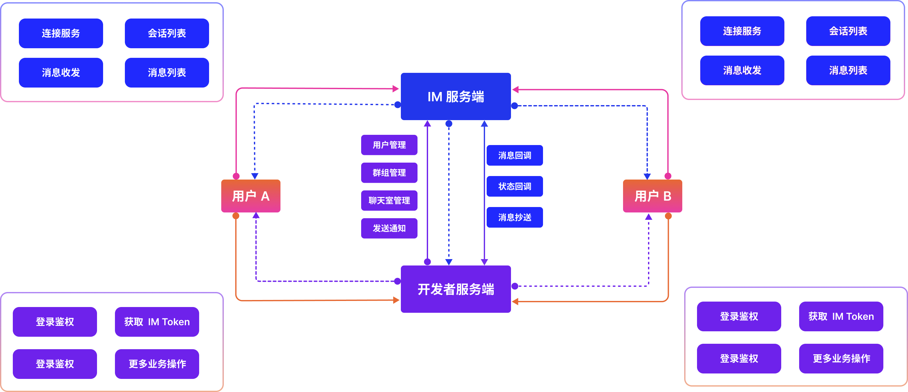
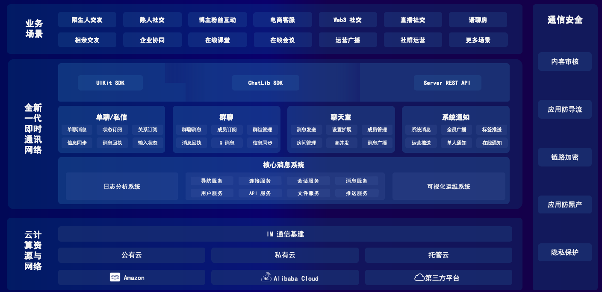

### Product Introduction{#intro}

Instant messaging (IM) has become an essential part of both work and daily life. Every day, we exchange text, voice, images, and many other types of information. As businesses increasingly prioritize communication autonomy and data security, more developers require IM solutions that offer flexible deployment options and full control over data storage.

To address these needs, JIM provides a next-generation IM system that allows developers to independently choose both the deployment model and the data storage location. It supports both `public cloud` and `private cloud` deployments, with the same core features available in each mode. Depending on your business stage and requirements, you can opt for a highly autonomous private-cloud deployment with full control over data storage, or use a simple, reliable, ready-to-use public-cloud service.

An IM integration typically involves three components: the `IM server`, the `developer server`, and the `client (user)`. The client refers to the app or website connected to the IM SDK. The interaction among these three components is illustrated below:

To simplify integration with developer services, the IM platform provides SDKs for `Android`, `iOS`, `Web`, and `Electron`, and also supports IM server REST APIs and WebHook callbacks. It includes user and group information management, so when developers process recent conversations or message lists, they do not need to fetch related user or group details separately. The SDK automatically assembles and returns this information to the business layer, enabling developers to build IM features more efficiently and render only what their application requires.

#### Single chat{#private}

Single chat refers to one-to-one communication in IM products. In real business scenarios, it can be used for _private messaging between acquaintances_, _follow or mutual-follow interactions_, _streamer-fan interactions_, _stranger messaging_, _buyer-to-buyer communication_, and more. By default, single chat supports text, image, voice, and file messages. If you need additional message types, you can extend them with [custom messages](../client/sdkintro/message/msg_send/custom.md). The core steps for implementing single chat are as follows:

> 1. Create a project in the developer console and obtain the AppKey and Secret.

> 2. The developer server calls the user registration API to generate IM tokens for users A and B.

> 3. Launch two apps or two browser sessions, and connect both clients to the IM server by following the quick integration guide.

> 4. After A and B are connected successfully, user A calls `sendMessage`, sets the session type to `PRIVATE`, and uses B's user ID as the session ID.

> 5. B's message event listener is triggered and receives the message sent by A.

#### Group chat{#group}

Group chat refers to communication among two or more users in IM products. In business scenarios, it can be used for _friend groups_, _fan communities_, _car-owner groups_, _parent groups_, _company groups_, _department groups_, _after-sales support groups_, and more. By default, group chat supports text, image, voice, and file messages, just like single chat. If you need additional message types, you can extend them with [custom messages](../client/sdkintro/message/msg_send/custom.md). The core steps for implementing group chat are as follows:

> 1. Create a project in the developer console and obtain the AppKey and Secret.

> 2. The developer server calls the user registration API to generate IM tokens for users A, B, and C.

> 3. The developer server creates a group with the ID `GroupId01`, with A, B, and C as members.

> 4. The developer server calls the IM group management REST API [Create Group](../server/group/groupcreate.md) to synchronize the group information to the IM server.

> 5. After A connects successfully, A calls `sendMessage`, sets the session type to `GROUP`, and sets the session ID to `GroupId01`.

> 6. After B and C connect successfully, their message event listeners are triggered and they receive the group message sent by A.

#### Chatroom{#chatroom}

Chatrooms are commonly used in live-streaming scenarios where users send real-time messages or bullet comments. They are mainly used for live chat, gift interactions, and signaling control. Typical use cases include _e-commerce live streaming_, _talent live streaming_, _online classes_, _entertainment streams_, _event broadcasts_, _news broadcasts_, and _voice chat rooms_. Features in these scenarios may include `likes`, `gift sending`, `bullet comments`, `room member count`, and `shopping cart` interactions. The core steps are as follows:

> 1. Create a project in the developer console and obtain the AppKey and Secret.

> 2. The developer server calls the user registration API to generate IM tokens for users A, B, and C.

> 3. The developer server creates the chatroom ID `ChatroomId01`. Chatroom members do not need to be synchronized in advance and can join directly from the client side.

> 4. The developer server calls the IM group management REST API [Create Chat Room](../server/chatroom/createchatroom.md) to synchronize the chatroom to the IM server.

> 5. After A connects successfully, A calls `joinChatroom` to join `ChatroomId01`.

> 6. A calls `sendMessage`, sets the session type to `CHATROOM`, and sets the session ID to `ChatroomId01`.

> 7. After B and C connect successfully, they call `joinChatroom` to join `ChatroomId01`.

> 8. After B and C join successfully, their message event listeners are triggered and they receive the message sent by A in `ChatroomId01`.

#### System notification {#sys_notice}

System notifications are one-way messages pushed from the server to users in IM products. Both `system notifications` and `single chat` involve communication between two parties, but unlike single chat, system notifications can only be sent through the server API. End users can receive them but cannot reply directly. System notifications support text, image, voice, file, and custom messages. They are commonly used for _broadcast notifications_, _tag-based notifications_, _official account messaging_, and similar scenarios. The core steps are as follows:

> 1. Create a project in the developer console and obtain the AppKey and Secret.

> 2. The developer server calls the user registration API to generate IM tokens for users A, B, and C.

> 3. The developer server calls the [System Notification](../server/message/sysmsg.md) API as the system user `system_user` to send broadcast messages.

> 4. After B and C connect successfully, their message event listeners are triggered and they receive the system notification sent by `system_user`.

### Product Matrix{#matrix}

